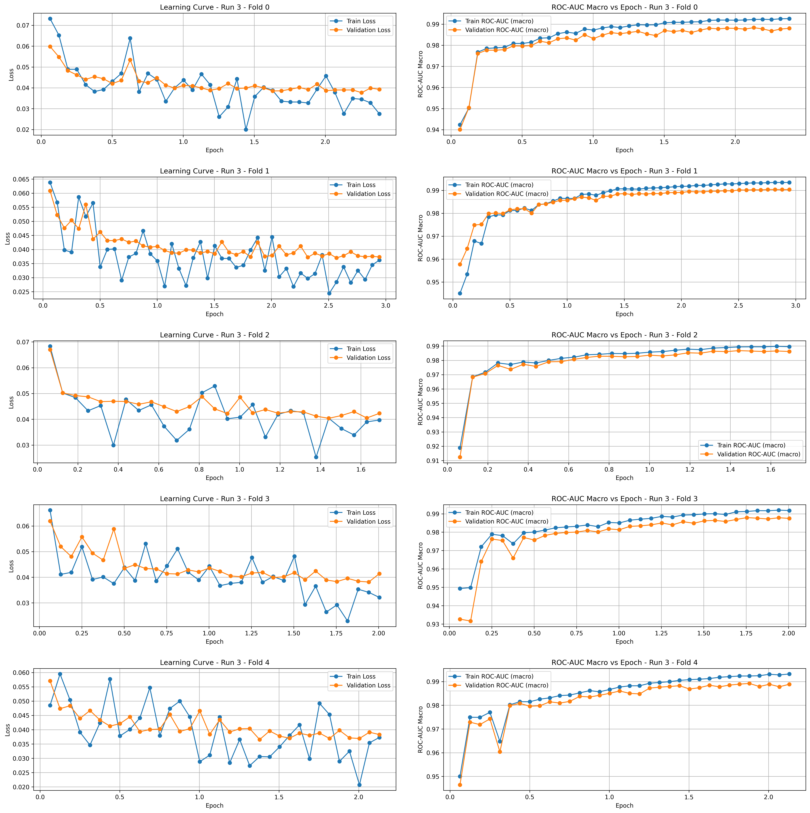

## 1 Project overview & key results  

This project addresses the [**Jigsaw Toxic Comment Classification Challenge**](https://www.kaggle.com/competitions/jigsaw-toxic-comment-classification-challenge/overview) on ``Kaggle``, delivered as the technical test for a Data Scientist position at **``Law Business Research``**. The model is evaluated by the mean column-wise ROC-AUC required by the competition.

<div align="center">

| Data split | Metric | Score |
|------------|--------|-------|
| 5-fold cross-validation (train) | **Macro ROC-AUC** | **0.9885 ± 0.0012** |
| Kaggle test set (public) | **Mean column-wise ROC-AUC** | **0.9840** |

</div>

## 2. My approach and rationales  

### 2.1 Architecture  
The core of the system is a transformer that has been fine-tuned for multi-label classification. I keep the encoder exactly as it comes from the ``Hugging Face`` Hub and replace the original language-model head with a single dense layer whose six outputs are squashed by a sigmoid, one probability per label. This minimal change lets the network reuse the powerful contextual representations it learned during large-scale pre-training while adapting quickly to the toxic-comment task. A design like this is standard in the literature because it adds almost no extra parameters and converges in a handful of epochs.  

### 2.2 Models explored and the choice of DeBERTa v3-base  
Before coding I compared the technical sheets and reported benchmarks of ``BERT``, ``RoBERTa`` and the newer ``DeBERTa`` family. ``DeBERTa v3`` stood out performing a consistent one-to-two-point lift on language tasks without an excessive jump in parameters. The large variant, however, pushes training time and memory well beyond what a single ``NVIDIA T4`` can offer, so I chose the base checkpoint (≈ 184 M parameters). With a batch size of 32 it fits comfortably into the T4’s 16 GB of VRAM and trains five folds overnight.

### 2.3 Pipeline stages and key hurdles  

#### 2.3.1 Pre-processing  
The dataset is not only imbalanced but doubly imbalanced: first between positive and negative samples and then across the six labels themselves, some appearing in only one percent of the rows. A conventional stratified split would leave several folds without any positives for the rare labels. To avoid that I used ``IterativeStratification`` from ``skmultilearn``, an algorithm that distributes label combinations as evenly as possible across folds.  

Tokenisation relies on DeBERTa’s own `AutoTokenizer`. After inspecting length histograms, I fixed `max_length = 256`, which captures more than 95 % of the comments while keeping memory usage low. The tokenizer also lower-cases text, removes stray HTML tags and normalises Unicode, so no additional cleaning was needed.  

#### 2.3.2 Model training  
Training follows a five-fold cross-validation protocol, a practice widely recommended when datasets are not huge and you want a dependable error bar. Each run uses a ``batch size`` of 32—larger batches fitted but showed weaker generalisation, a known effect in deep learning. The ``learning rate`` of 1 × 10⁻⁵ is the canonical starting point for transformer fine-tuning and worked well here. Three ``epochs`` were enough: most folds hit their performance ceiling after the second epoch, so extra passes only wasted compute.  

#### 2.3.4 Model evaluation  

##### 2.3.4.1 Cross-validation metrics  

Every fold reaches a high score, and the tiny standard deviation shows there is no unlucky split where the model collapses. This consistency indicates good generalisation rather than chance alignment with a particular slice of data.  

| Fold | ROC-AUC (macro) |
|------|-----------------|
| 0 | 0.988 3 |
| 1 | 0.990 4 |
| 2 | 0.986 8 |
| 3 | 0.987 9 |
| 4 | 0.989 2 |
| **Mean** | **0.988 5** |
| **Std.dev.** | **0.001 2** |

##### 2.3.4.2 Learning and ROC-AUC curves  



The curves tell a coherent story: training and validation losses drop sharply during the first two epochs and then level off, while ROC-AUC climbs to a plateau at the same point. The small, stable gap between the blue (train) and orange (validation) lines means the network is neither under-fitting nor over-fitting; it simply stops learning useful patterns after epoch 2.  

#### 2.3.5 Inference  

Predictions on the ``Kaggle`` test set confirm the validation findings. All six labels score well above 0.97, and the mean column-wise ROC-AUC of 0.984 is competitive for this challenge. Because this is the metric ``Kaggle`` uses for ranking, it is the headline figure quoted in the introduction.  

| Label | ROC-AUC |
|-------|---------|
| toxic | 0.9755 |
| severe_toxic | 0.9906 |
| obscene | 0.9833 |
| threat | 0.9837 |
| insult | 0.9827 |
| identity_hate | 0.9880 |
| **Mean (official metric)** | **0.9840** |

## 3 Code structure  

The repository follows three simple rules: keep datasets and models version-controlled, keep **all** analysis in notebooks for transparency, and store every artefact in a predictable folder. With this layout a reviewer can follow the full journey—from raw Kaggle CSVs to the final `predictions.csv`—without guessing where files live.

```
root_dir/
│
├─ data/                         # raw and processed datasets
│   ├─ original/                 # Kaggle CSVs as downloaded
│   └─ processed/                # Arrow files created with 🤗 Datasets
│
├─ model_checkpoints/            # intermediate and final weights
│   └─ microsoft/
│       └─ deberta-v3-base/
│           ├─ run_0/ … run_3/   # separate training runs
│           │   └─ fold_0/
│           │       ├─ checkpoint-*/   # last two checkpoints
│           │       ├─ model_final/    # best model per fold
│           │       └─ log_history.json
│           └─ …                      # other folds
│
├─ notebooks/                    # narrative analysis
│   ├─ 1_eda.ipynb
│   ├─ 2_preprocessing.ipynb
│   ├─ 3_model_training.ipynb
│   ├─ 4_model_evaluation.ipynb
│   └─ 5_inference.ipynb
│
├─ results/                      # metrics, plots, predictions
│   └─ microsoft/
│       └─ deberta-v3-base/
│           └─ run_0/ … run_3/   # separate training runs
│               ├─ evaluation/
│               │   ├─ folds_scores_roc_auc.csv
│               │   └─ learning_and_ROC_AUC_curves.png
│               └─ inference/
│                   ├─ predictions_logits.npz
│                   ├─ predictions_scores_roc_auc.csv
│                   └─ predictions.csv
│
├─ .gitignore
├─ config.py                     # paths & hyper-parameters
├─ LICENSE
├─ README.md                     # this document
└─ requirements.txt              # exact package versions
```

Everything lives in notebooks, with `config.py` acting as the single source of truth for paths and hyper-parameters. To reproduce the pipeline you only need:

```bash
pip install -r requirements.txt
```

Run the notebooks in order and all artefacts—checkpoints, logs, plots, predictions—will be rebuilt in the directories shown above, guaranteeing that results are transparent and repeatable.

## 4. Potential future avenues  

### 4.1 Improvements unlocked by more compute  

The most direct way to raise the ceiling is to fine-tune the ``**DeBERTa v3-large**`` model instead of the base checkpoint. Published benchmarks show that the large variant regularly adds one to two ROC-AUC points over its smaller sibling on text-classification tasks thanks to deeper layers and wider feed-forward blocks. Bringing that extra capacity to the toxic-comment problem would almost certainly lift the overall score, although training would demand several days on high-end GPUs instead of a single night on a T4.  

While the current run caps sequences at 256 tokens, an audit of comment lengths revealed that this window covers only **95.95 %** of the dataset. Raising the limit to 512 tokens bumps coverage to **98.76 %**, and 1 024 tokens pushes it to **99.98 %**. Longer contexts give the model access to discourse markers and co-reference clues that may be cut off today, so a small but measurable gain is plausible. The price is quadratic growth in attention cost and a three-to-four-fold increase in wall-clock time, making this avenue attractive only when additional GPUs and time are available.  

The present system stops after three epochs because validation curves flatten early and an *early-stopping* callback halts training. Yet large-scale studies show that adding two extra passes can still squeeze out marginal gains once regularisation is tuned, especially when the model size also grows. With a longer deadline it would be worth extending training to five epochs, disabling early stopping, and checking whether those final steps tighten the decision boundary by a few tenths of a percentage point.  

A further experiment, feasible only with more compute, is to **train on the full dataset** instead of leaving out a validation split. Starting from the best fold checkpoint and continuing training on 100 % of the data would expose the model to roughly 20 % more examples than any cross-validation run. The final assessment would then rely exclusively on the hidden Kaggle test set. This could recover a small extra margin because every parameter sees more evidence, but it comes at the cost of losing an internal early-stopping signal, so hyper-parameters would have to be fixed beforehand using the earlier CV results.  

### 4.2 Systematic testing  

No automated tests were written because the brief focused on modelling rather than deployment and the timeline was tight. In a production setting, however, even a minimal **pytest** suite dramatically increases robustness. Unit tests can validate that preprocessing functions handle edge cases (empty strings, emojis, mixed scripts), integration tests can ensure that a full training cycle runs end-to-end on a sample split, and regression tests can lock in expected metrics so that future refactors do not silently degrade performance. Continuous Integration would then catch data-drift bugs or tensor-shape mismatches before they reach users.  

### 4.3 Targeted error analysis  

A fruitful next step is to dive into the misclassifications and look for recurring patterns. Prior work on toxic-comment models shows that many errors stem from sarcasm, rare slurs or annotation noise. By clustering the false positives and false negatives, inspecting them manually and tagging the root causes, we can design focused fixes: add new training examples, introduce rule-based post-filters or create augmentation pipelines for the problematic language. Studies that combined such error-driven iterations with neural models reported noticeable jumps in final accuracy.  

## 5 Potential challenges for deployment  

The competition is set up to reward the highest possible ROC-AUC, regardless of how large, slow or expensive the resulting model may be; it deliberately ignores factors such as training cost, inference latency or memory footprint. In a production environment these constraints matter a great deal, so the very strengths that pushed the score up during the contest can turn into obstacles when the system has to serve real-time traffic.

The current checkpoint of ``**DeBERTa v3-base**`` weighs in at roughly 184 million parameters and, even after optimised batching, still needs several hundred milliseconds per request on commodity CPUs. That makes it difficult to meet tight latency budgets or run cost-effectively at scale.  

- **Swap to a lighter backbone.** Smaller transformers or linear-attention variants cut both memory and latency, usually at the cost of a fraction of a point in accuracy.
- **Distil the model.** Knowledge-distillation techniques train a compact *student* network to imitate the big *teacher*, retaining most of the quality while shrinking size and inference time dramatically.  
- **Apply quantisation.** Converting weights and activations from 32-bit floats to 8-bit integers reduces the model to a quarter of its original size and typically halves latency without re-training the full network.

A further operational challenge is that language on the internet evolves quickly. New slurs, coded phrases and cultural references appear constantly, so a static model’s performance will drift down over time. The remedy is to schedule periodic re-training or at least incremental fine-tuning on fresh, human-labelled data so the classifier stays current with emerging forms of toxicity.

## 6 AI usage  

I used ``ChatGPT`` (model o3) as my main brainstorming partner. It helped me map out the project at a high level, from choosing the backbone model to outlining the training and validation strategy, even suggesting sensible defaults for hyper-parameters and data splits.


The assistant also guided me through tricky code sections, in particular writing a custom `Trainer` that logs ROC-AUC on the training set—something the stock Hugging Face `Trainer` does not provide out of the box. Working interactively saved time and kept the code readable.  

This document itself was drafted with ChatGPT, starting from my bullet-point outline of each section. The model’s suggestions shortened the writing phase and helped me maintain clear, simple English throughout.  

Finally, I used ChatGPT for quick refactoring passes—renaming variables, adding docstrings and spotting dead code—so the final repository follows consistent style and good engineering practice.  
